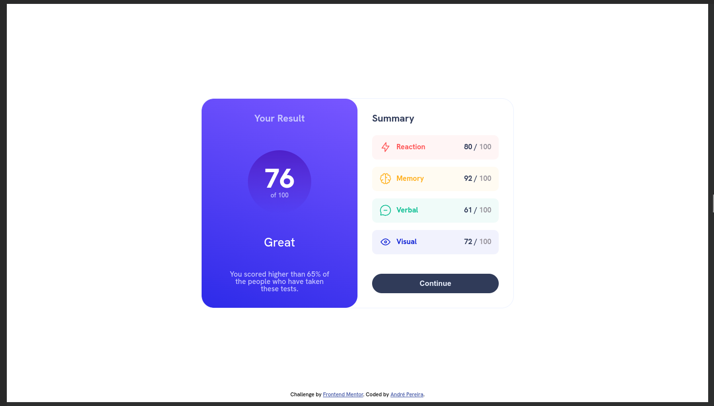
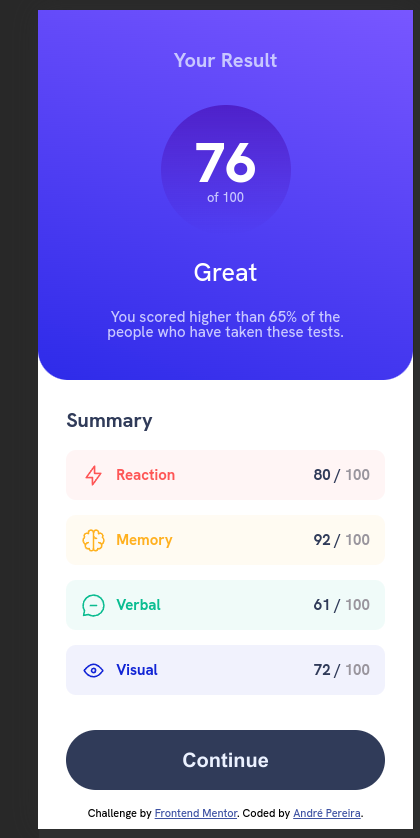

# Frontend Mentor - Results summary component solution

This is a solution to
the [Results summary component challenge on Frontend Mentor](https://www.frontendmentor.io/challenges/results-summary-component-CE_K6s0maV).
Frontend Mentor challenges help you improve your coding skills by building realistic projects.

## Table of contents

- [Overview](#overview)
    - [The challenge](#the-challenge)
    - [Screenshots](#screenshots)
    - [Links](#links)
- [My process](#my-process)
    - [Built with](#built-with)
    - [Useful resources](#useful-resources)
- [Author](#author)

**Note: Delete this note and update the table of contents based on what sections you keep.**

## Overview

### The challenge

Users should be able to:

- View the optimal layout for the interface depending on their device's screen size
- See hover and focus states for all interactive elements on the page
- **Bonus**: Use the local JSON data to dynamically populate the content

### Screenshots

#### Desktop

#### Mobile

### Links

- Solution
  URL: [Solution](https://www.frontendmentor.io/solutions/vanilla-solution-populating-the-content-using-a-json-ocegE-NLcS)
- Live Site URL: [GitHub Pages](https://dre1597.github.io/fm-results-summary-component/)

## My process

### Built with

- Semantic HTML5 markup
- CSS custom properties
- Flexbox

### Useful resources

- [Reset CSS](https://meyerweb.com/eric/tools/css/reset/)

## Author

- Frontend Mentor - [@dre1597](https://www.frontendmentor.io/profile/dre1597)
- LinkedIn - [@dre1597](https://www.linkedin.com/in/dre1597/)
